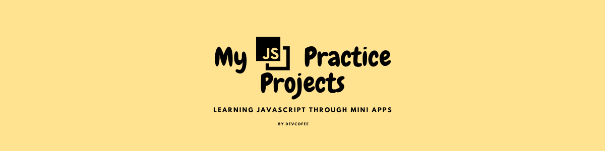

  

Welcome✨! This repository contains a collection of small projects I'm building as I learn JavaScript. Each folder includes its own mini-project, source code, and a README file explaining what it does.

## 📁 Projects

- [📱 iPhone Calculator](./Calculator) – A replica of the iOS calculator built with HTML, CSS, and JavaScript.
- [Tic Tac Toe](./Tic-Tac-Toe) 
<!-- - [⏰ Digital Clock](./DigitalClock) – Shows the current time using the JavaScript `Date` object.  
- [💵 Tip Calculator](./TipCalculator) – Calculates tips and total bill based on user input.  
- [🔢 Counter App](./CounterApp) – A simple + and − counter with reset button.  
- [🎨 Color Changer](./ColorChanger) – Changes background color randomly or by choice.  
- [📋 To-Do List](./ToDoList) – Add, complete, and delete tasks with localStorage.  
- [🖼️ Image Slider](./ImageSlider) – Cycle through images using buttons or arrows.  
- [🧠 Quiz App](./QuizApp) – Multiple-choice quiz that shows your score at the end.  
- [🔐 Password Checker](./PasswordChecker) – Checks and rates password strength live.  
- [📦 Modal Popup](./ModalPopup) – Click to open a modal and close it by clicking outside.  
- [🌦️ Weather App](./WeatherApp) – Fetches real-time weather using OpenWeatherMap API.  
- [💱 Currency Converter](./CurrencyConverter) – Converts between currencies using exchange rate API.  
- [⌨️ Typing Speed Test](./TypingTest) – Measures your typing speed and accuracy.  
- [🎧 Music Player](./MusicPlayer) – Play, pause, and skip songs with playlist and progress bar.  
- [🖌️ Drawing App](./DrawingApp) – A basic paint app using the canvas element. -->

More projects coming soon!

## 🎯 Goals

- Practice vanilla JavaScript (no frameworks at first).
- Improve my front-end skills.
- Build a portfolio I can be proud of.

 
 

🚀 Stay tuned for more!
